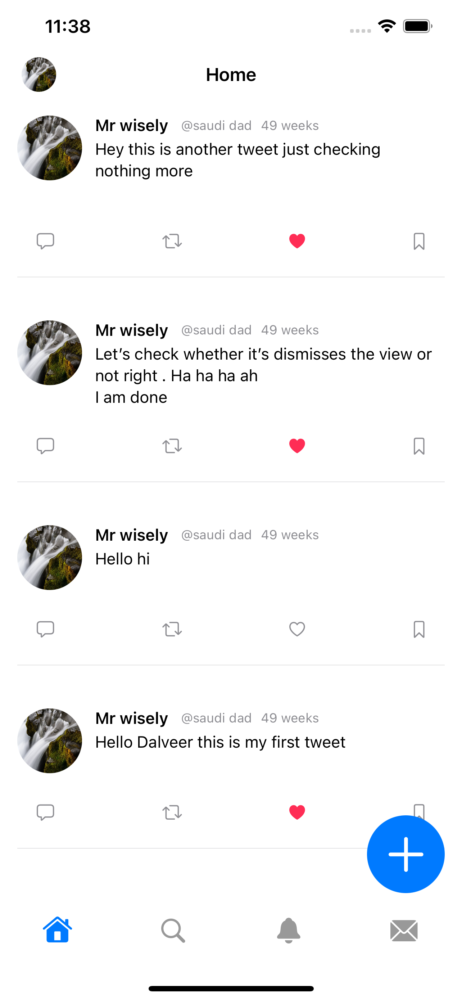
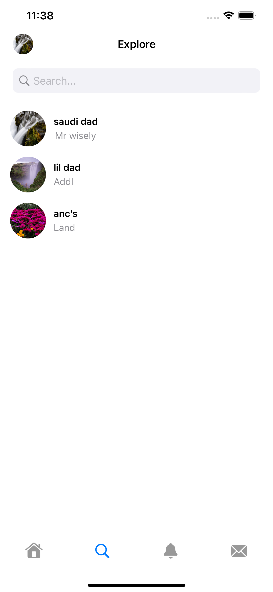
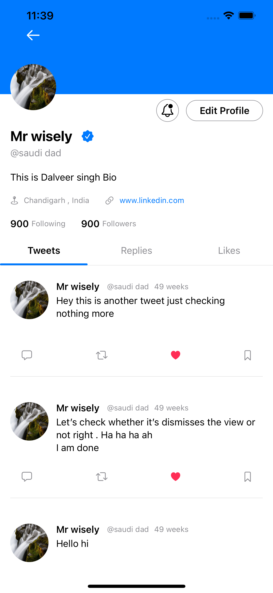
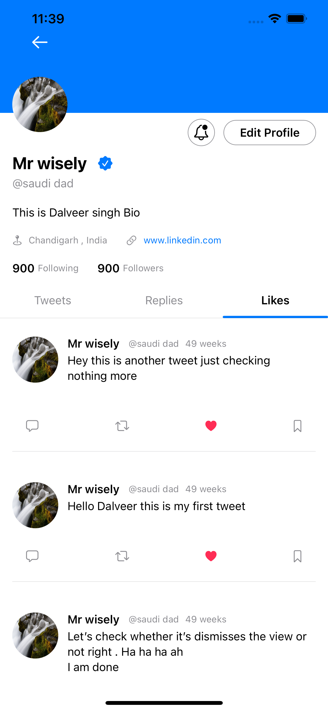

# Lets-Tweet
## Getting Started ##

1. git clone [https://github.com/singhbaidwan/Lets-Tweet](https://github.com/singhbaidwan/Lets-Tweet)  
2. cd Eagle. 
## Screenshots ##

<table>
<tr>
<td></td>
<td> </td>
<td></td>
</tr>
 
<tr>
<td></td>
<td> </td>
<td></td>
</tr>
   

<tr>
<td></td>
<td> </td>
<td> </td>
</tr>
 

  <tr>
<td></td>
<td> </td>
</tr>
</table>
